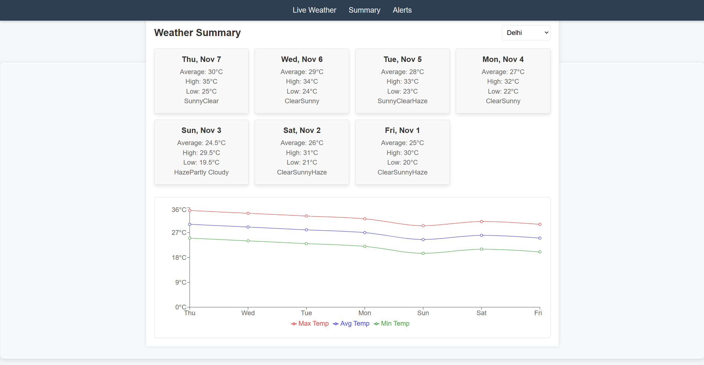
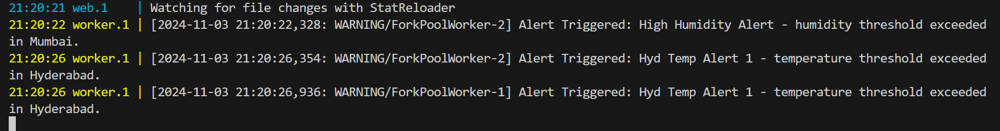
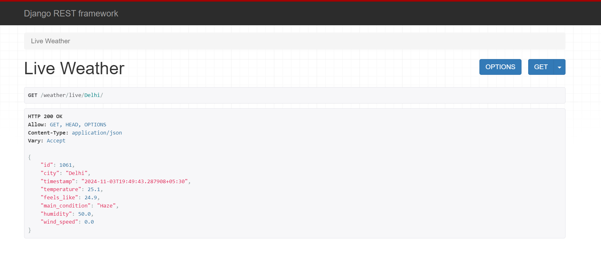
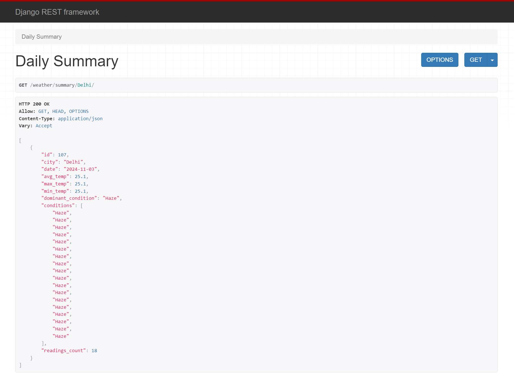
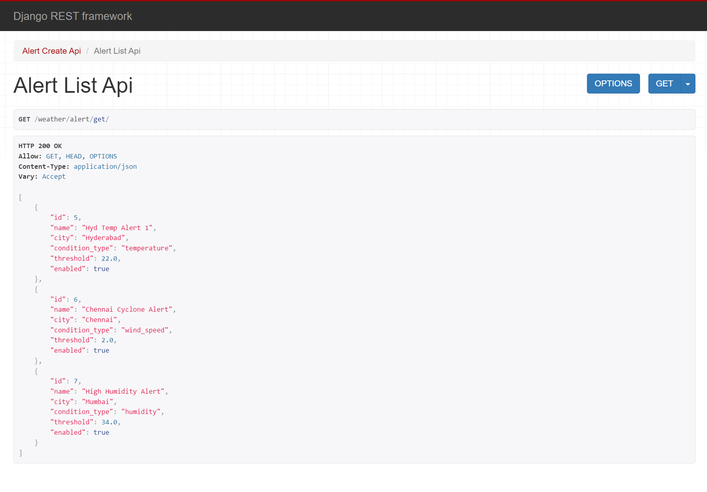

# WeatherWatch

A real-time data processing system built with Django, React.js, PostgreSQL that monitors weather conditions in major Indian cities using the OpenWeatherMap API. This system processes and summarizes weather data in real-time and generates rollups and aggregates, such as daily weather summaries and alerts based on custom thresholds.



## Features

* 🌦️ Continuous weather data collection from OpenWeatherMap
* 📊 Daily summaries with temperature aggregates and dominant weather conditions
* ⚠️ Real-time alerting based on configurable weather thresholds
* 📈 Visualizations for daily summaries
* 🐍 Django, Celery, and Redis for task management and data processing


## System Architecture

### Backend (Django)
* REST API endpoints for accessing weather summaries and alerts
* Database storage for raw weather readings and daily summaries
* Integration with Celery and Redis for asynchronous task scheduling


## Installation
```bash
git clone https://github.com/Mayankrai449/WeatherWatch.git
```

### Backend Setup
```
cd backend
```

#### Windows
```bash
# Create virtual environment
python -m venv venv
venv\Scripts\activate

# Install dependencies
pip install -r requirements.txt

# Setup environment variables
copy .env.example .env  # Update with your configurations

# Database setup
python manage.py makemigrations
python manage.py migrate

# Run server
honcho start
```

#### Linux/MacOS
```bash
# Create virtual environment
python3 -m venv venv
source venv/bin/activate

# Install dependencies
pip install -r requirements.txt

# Setup environment variables
cp .env.example .env  # Update with your configurations

# Database setup
python manage.py makemigrations
python manage.py migrate

# Run server
honcho start
```

### Frontend Setup
```bash
# Install dependencies
cd ../frontend
npm install

# Start development server
npm start
```

## Environment Configuration

### Backend (.env)

Create a `.env` file in the root directory with the following configuration:

```plaintext
SECRET_KEY=__your_django_secret__
DEBUG=True
ALLOWED_HOSTS=*
CORS_ALLOWED_ORIGINS=http://localhost:3000

DB_NAME=weatherdb
DB_USER=__your_username__
DB_PASSWORD=__yourpassword__
DB_HOST=localhost
DB_PORT=5432

REDIS_HOST=localhost
REDIS_PORT=6379
CELERY_BROKER_URL=redis://localhost:6379/0
CELERY_RESULT_BACKEND=redis://localhost:6379/0

OPENWEATHERMAP_API_KEY=__your_api_key__
```

### Frontend Configuration
Check `src/services/api.js` to configure the backend URL:
```javascript
const API_BASE_URL = 'http://127.0.0.1:8000';
// Adjust as per your configuration
```

## Usage

### 1. Weather Data Collection
The system continuously fetches weather data at regular intervals (e.g., every 5 minutes) for major Indian cities like Delhi, Mumbai, and others.

### 2. Daily Weather Summaries
Rollups are created daily, including:
* **Average Temperature**: Calculated from all readings
* **Max/Min Temperature**: Based on daily extremes
* **Dominant Condition**: Most frequent weather condition for the day

### 3. Real-Time Alerting
Configurable temperature thresholds (e.g., alert if temperature > 35°C) trigger alerts if breached.



## API Endpoints

### Fetch Current Weather
```bash
GET /weather/live/<str:city>/
```



### Fetch Weather Summaries
```bash
GET /weather/summary/<str:city>/
```



### Post Alerts
```bash
POST /weather/alerts/
```

### Fetch All Alerts
```bash
GET /weather/alert/get/
```



## Test Data

To test the frontend functionality with sample daily weather summaries, you can use the following SQL insert statements. These statements provide a week's worth of weather data for major Indian cities with realistic temperature variations and weather conditions.

```sql
-- Add test data for daily weather summaries
INSERT INTO weather_daily_summary 
(city, date, avg_temp, max_temp, min_temp, dominant_condition, conditions, readings_count)
VALUES
-- Delhi (generally hotter, more variable)
('Delhi', '2024-11-01', 25.0, 30.0, 20.0, 'Clear', ARRAY['Clear', 'Sunny', 'Haze'], 24),
('Delhi', '2024-11-02', 26.0, 31.0, 21.0, 'Sunny', ARRAY['Clear', 'Sunny', 'Haze'], 24),
('Delhi', '2024-11-03', 24.5, 29.5, 19.5, 'Haze', ARRAY['Haze', 'Partly Cloudy'], 24),
('Delhi', '2024-11-04', 27.0, 32.0, 22.0, 'Clear', ARRAY['Clear', 'Sunny'], 24),
('Delhi', '2024-11-05', 28.0, 33.0, 23.0, 'Sunny', ARRAY['Sunny', 'Clear', 'Haze'], 24),
('Delhi', '2024-11-06', 29.0, 34.0, 24.0, 'Clear', ARRAY['Clear', 'Sunny'], 24),
('Delhi', '2024-11-07', 30.0, 35.0, 25.0, 'Sunny', ARRAY['Sunny', 'Clear'], 24),

-- Mumbai (coastal, humid, more moderate)
('Mumbai', '2024-11-01', 27.0, 31.0, 23.0, 'Partly Cloudy', ARRAY['Partly Cloudy', 'Humid'], 24),
('Mumbai', '2024-11-02', 27.5, 32.0, 23.0, 'Cloudy', ARRAY['Cloudy', 'Light Rain', 'Humid'], 24),
('Mumbai', '2024-11-03', 28.0, 32.5, 23.5, 'Humid', ARRAY['Humid', 'Partly Cloudy'], 24),
('Mumbai', '2024-11-04', 27.0, 31.0, 23.0, 'Light Rain', ARRAY['Light Rain', 'Cloudy', 'Humid'], 24),
('Mumbai', '2024-11-05', 26.5, 30.5, 22.5, 'Cloudy', ARRAY['Cloudy', 'Humid'], 24),
('Mumbai', '2024-11-06', 27.0, 31.5, 22.5, 'Partly Cloudy', ARRAY['Partly Cloudy', 'Humid'], 24),
('Mumbai', '2024-11-07', 28.0, 32.0, 24.0, 'Humid', ARRAY['Humid', 'Partly Cloudy'], 24),

-- Bangalore (moderate climate)
('Bangalore', '2024-11-01', 22.0, 27.0, 17.0, 'Clear', ARRAY['Clear', 'Mild'], 24),
('Bangalore', '2024-11-02', 21.5, 26.5, 16.5, 'Partly Cloudy', ARRAY['Partly Cloudy', 'Mild'], 24),
('Bangalore', '2024-11-03', 22.0, 27.0, 17.0, 'Clear', ARRAY['Clear', 'Mild'], 24),
('Bangalore', '2024-11-04', 21.0, 26.0, 16.0, 'Cloudy', ARRAY['Cloudy', 'Light Rain'], 24),
('Bangalore', '2024-11-05', 20.5, 25.5, 15.5, 'Light Rain', ARRAY['Light Rain', 'Cloudy'], 24),
('Bangalore', '2024-11-06', 21.5, 26.5, 16.5, 'Clear', ARRAY['Clear', 'Mild'], 24),
('Bangalore', '2024-11-07', 22.5, 27.5, 17.5, 'Sunny', ARRAY['Sunny', 'Clear'], 24),

-- Chennai (hot and humid)
('Chennai', '2024-11-01', 29.0, 33.0, 25.0, 'Humid', ARRAY['Humid', 'Partly Cloudy'], 24),
('Chennai', '2024-11-02', 28.5, 32.5, 24.5, 'Partly Cloudy', ARRAY['Partly Cloudy', 'Humid'], 24),
('Chennai', '2024-11-03', 29.5, 33.5, 25.5, 'Cloudy', ARRAY['Cloudy', 'Humid', 'Light Rain'], 24),
('Chennai', '2024-11-04', 30.0, 34.0, 26.0, 'Light Rain', ARRAY['Light Rain', 'Humid'], 24),
('Chennai', '2024-11-05', 29.0, 33.0, 25.0, 'Humid', ARRAY['Humid', 'Partly Cloudy'], 24),
('Chennai', '2024-11-06', 28.5, 32.5, 24.5, 'Partly Cloudy', ARRAY['Partly Cloudy', 'Humid'], 24),
('Chennai', '2024-11-07', 29.0, 33.0, 25.0, 'Humid', ARRAY['Humid', 'Clear'], 24),

-- Kolkata (variable, humid)
('Kolkata', '2024-11-01', 26.0, 31.0, 21.0, 'Humid', ARRAY['Humid', 'Partly Cloudy'], 24),
('Kolkata', '2024-11-02', 27.0, 32.0, 22.0, 'Partly Cloudy', ARRAY['Partly Cloudy', 'Humid'], 24),
('Kolkata', '2024-11-03', 26.5, 31.5, 21.5, 'Light Rain', ARRAY['Light Rain', 'Cloudy', 'Humid'], 24),
('Kolkata', '2024-11-04', 25.5, 30.5, 20.5, 'Cloudy', ARRAY['Cloudy', 'Humid'], 24),
('Kolkata', '2024-11-05', 26.0, 31.0, 21.0, 'Humid', ARRAY['Humid', 'Partly Cloudy'], 24),
('Kolkata', '2024-11-06', 27.5, 32.5, 22.5, 'Clear', ARRAY['Clear', 'Humid'], 24),
('Kolkata', '2024-11-07', 28.0, 33.0, 23.0, 'Sunny', ARRAY['Sunny', 'Clear', 'Humid'], 24),

-- Hyderabad (hot, relatively dry)
('Hyderabad', '2024-11-01', 24.0, 29.0, 19.0, 'Clear', ARRAY['Clear', 'Sunny'], 24),
('Hyderabad', '2024-11-02', 25.0, 30.0, 20.0, 'Sunny', ARRAY['Sunny', 'Clear'], 24),
('Hyderabad', '2024-11-03', 26.0, 31.0, 21.0, 'Clear', ARRAY['Clear', 'Sunny'], 24),
('Hyderabad', '2024-11-04', 25.5, 30.5, 20.5, 'Partly Cloudy', ARRAY['Partly Cloudy', 'Clear'], 24),
('Hyderabad', '2024-11-05', 24.5, 29.5, 19.5, 'Clear', ARRAY['Clear', 'Sunny'], 24),
('Hyderabad', '2024-11-06', 25.0, 30.0, 20.0, 'Sunny', ARRAY['Sunny', 'Clear'], 24),
('Hyderabad', '2024-11-07', 26.0, 31.0, 21.0, 'Clear', ARRAY['Clear', 'Sunny'], 24);
```

